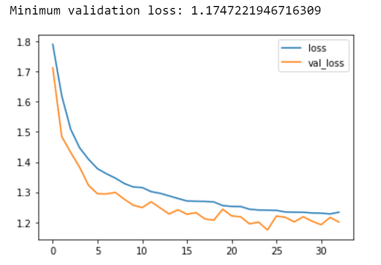
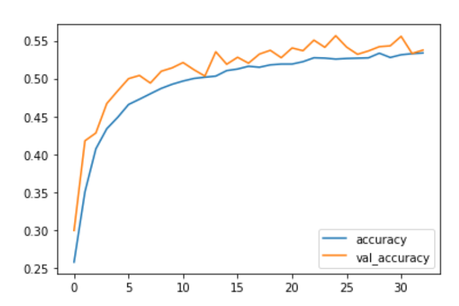

# Emotion recognition
Machine Learning project, the goal is to be able to detect 7 different emotions (sad, happy, surprise, disgust, angry,fear and neutral). To do so, different CNN are implemented in order to compare the performance between them.

Author  : Julien Jacquot

# The data set

The data set was provided by the web site Kaggle https://www.kaggle.com/deadskull7/fer2013 
It is a data set composed of nearly 35 k gray images (48x48).

The data set is imbalanced but this issue can be tackled thanks to Data augmentation, which is used in some of the following models. 

# Installation

pip install deepface
pip install tensorflow-gpu
pip install opencv-python

# Description

**Folder Deepface :** Deepface is a deep learning facial recognition system which is already very efficient. It was implemented at the beginning of the project so as to understand the topic.

**Folder Models :** Here are stored 3 python programms, each one of them created a new model : 
      1 - "Model with MobileNetV2" and "Mobile with VGG 16" are two models that use transfer learning. MobileNetV2 and VGG 16 CNN were first used and then some layers were added at the end of them. 
      2  - Model from scratch : The model was created without the concept of transfer learning

**Folder Models to  load :** Here are stored the different models that one can load to use It

**Folder test the models :** Here are stored python programm which are aimed at testing the different models created. The goal is to compare the performance between the differents models.

Model from Scratch  : The accuracy is around 56 %, which is correct for a model from scratch.

Models with MobileNetV2 and VGG16 the accuracy is around 45 % which is quite low for models using transfer learning. It seems that the layers added after the loaded models are not optimal, some improvements have to be made.

# Sources

1 - Websites :
                    Kaggle : https://www.kaggle.com/
                    Toward data science : https://towardsdatascience.com/
2 - Youtube Channels : 
                    Great Learning  : https://www.youtube.com/watch?v=m0fWjP3yIEo&ab_channel=GreatLearning
                    Neha Yadav : https://www.youtube.com/watch?v=DtBu1u5aBsc&ab_channel=NehaYadav
                    DeepLearning_by_PhDScholar   https://www.youtube.com/watch?v=avv9GQ3b6Qg&t=1255s&ab_channel=DeepLearning_by_PhDScholar

